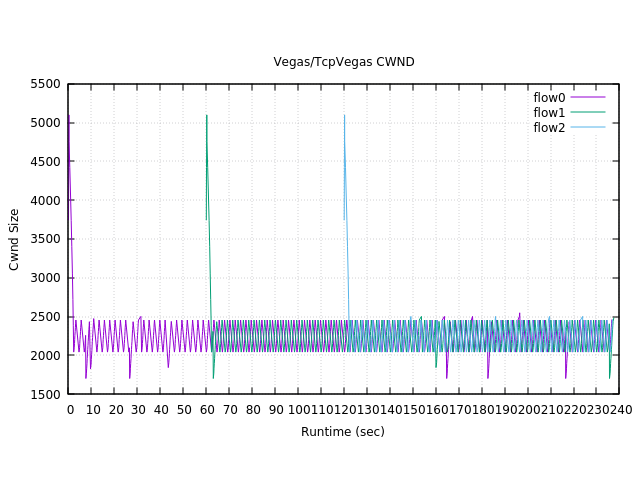
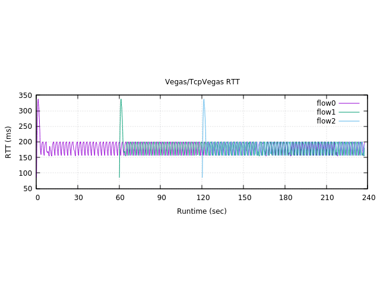
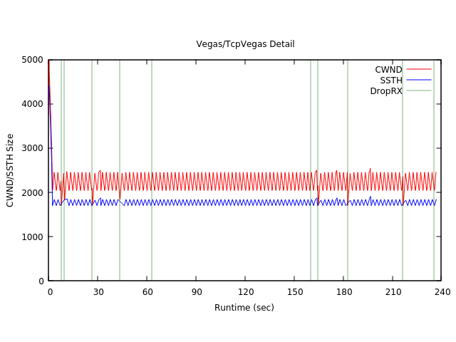
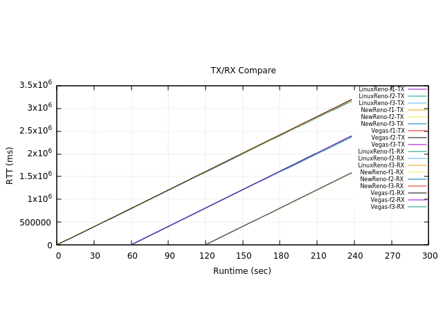
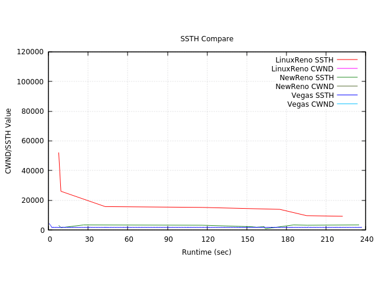
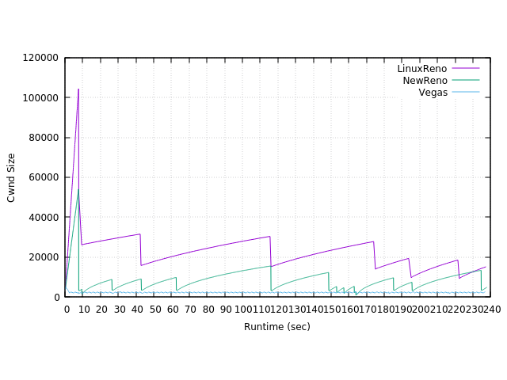
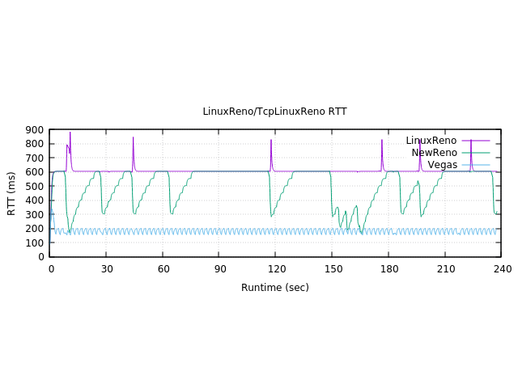

# Report

## Basic - 基礎數據

images 是匯出的資料

* {TCP-Proto}Cwnd.png - 壅塞窗格的變化



* {TCP-Proto}RTT.png - 來回通訊延遲的變化



* {TCP-Proto}Detail.png - CWND + SSTH + DropRx 時間點的整合



綠線所對應到的 X 軸，代表該時間點發生 RX Drop 事件



三者的 TX/RX Seq 數值累計，幾乎相同無特別的

## Compare 各項數據的交叉比對





## *.plt 檔案 - gnuplot 的腳本

## -log 檔案 - Runtime 的資訊

```sh
Protocol: ns3::<Tcp 的 Protocol> 

Bottleneck bandwidth: 250Kbps
Bottleneck delay: 35ms

Local Bandwidth: 125Kbps
Local Delay: 0.01ms

MTU Bytes: 400
IP Header size is: 20 Bytes
TCP Header size is: 20 Bytes
Segment size is: 340 Bytes
data size to transmit (MB): 0 (0 = 無限制)
how many connections: 3
It start at 0 sec, end at 240 sec

=========================

flow sources: 3
sink from 0s to 240s
sink from 60s to 240s
sink from 120s to 240s
tracing-flow0 Schedule arrange: 1 sec   # Flow-n 的開始 Tracing 時間
tracing-flow1 Schedule arrange: 61 sec 
tracing-flow2 Schedule arrange: 121 sec
Start flow1 At 0.1 sec # 提示 Flow-n 開始傳輸了
RxDrop at 7.67181 # 掉包的時間點
RxDrop at 9.67415
RxDrop at 26.7184
RxDrop at 43.5217
Start flow2 At 60.1 sec
RxDrop at 63.1077
Start flow3 At 120.1 sec  
RxDrop at 160.048
RxDrop at 164.694
RxDrop at 182.632
RxDrop at 216.507
RxDrop at 235.593
```

## 模擬方法

本次透過 NS3 的 `BulkHelper` 方法，建立了 3 條TCP連線，模擬FTP的傳輸情境
在 Local 端(相當於內網Router)的速度是每條線路 125Kbps，延遲 0.01 毫秒；
對外端點的速度是 250Kbps，延遲 35 ms。傳輸速度與延遲的設定，傳輸速度是依照 Simulate 可快速的模擬時間設定；延遲則是根據主機當時 ping 內網/外網的回饋設定的

模擬方法如下：在 t=0, t=60, t=120 會分別啟動一個 FTP 服務，並在 t=240 的時候停止所有服務。

這個設定的原因如下：

* 0 < t < 60 的時候，只有一個服務，此時 LocalLink 的 BitRate 遠小於 RemoteLink
* 60 < t < 120 的時候，共有兩個服務在運行，此時 LocalLink 的 BitRate 近似於 RemoteLink
* 120 < t 的時候，共有三個服務在運行，此時 LocalLink 的 BitRate 遠大於 RemoteLink

於此可以觀察到，當 Bottleneck 在 輕、中、重三種情境下的變化各項數值的變化

而 TCP 拓樸設定

由 10.0.(2n-1).1 當 Source 端
由 10.0.(2n).2 當 Sink 端

舉例來說，如果有三個測試服務的情況下：

* 10.0.1.1 <--> 10.0.2.2 n = 1
* 10.0.3.1 <--> 10.0.4.2 n = 2
* 10.0.5.1 <--> 10.0.6.2 n = 3

因為 TCP 是全雙工模式，因此會有 6 個 Flow


